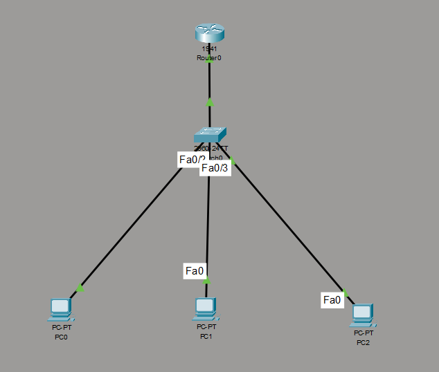
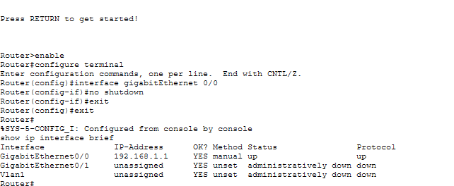
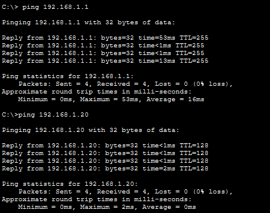

# Lab 01 – Build a Small Office Network

## 📌 1. Objective
The aim of this project was to build a Local Area Network (LAN) similar to one found in a typical office environment. The learning outcome of this lab was to understand the components required to connect multiple devices within a small network, as well as the basic configuration needed to enable network communication.

## 📐 2. Network Design
A small office network was created including a router, switch, and 3 PCs interconnected using Copper Straight-Through cables. The devices were configured to allow communication within the local network.

* **Devices:**
  * Router
  * Switch
  * 3 PCs
* **Topology:**
  * PCs connected to switch
  * Switch connected to router
* **Cable used:**
  * Copper Straight-Through

## ⚙️ 3. Configuration
I manually assigned an IP address to the router and 3 PCs, applying the principle of static IP addressing. This step was important to ensure that each device could be identified on the network and transfer data to one another. Also, I configured the PCs subnet mask to `255.255.255.0` and IP addresses with the same network portion of `192.168.1.x`, helping them decide how to send data, either directly or through the default gateway (the router).

Then I enabled the router's `GigabitEthernet 0/0` port via the Command Line Interface using the `no shutdown` command, allowing the router to use the physical link established by the copper cable.

## 🔍 4. Verification & Troubleshooting
I tested the router interface `GigabitEthernet 0/0` to see if it had been enabled by running the `show ip interface brief` command. A couple of times the console displayed that its status and protocol were `down`. I troubleshooted the issue by checking the cable ports on the router and switch and correcting the cable connection. After running the `show ip interface brief` command again, the router showed the status and protocol were both `up`. I verified that the connection was made by pinging the router from one of the PC's command prompt terminals, demonstrating that the PC could communicate with the router.

## 💡 5. Key Concepts Learned
* **IP addressing:** understanding devices need IP addresses to identify each other on the network.
* **Switches and routers:** recognizing their differing roles: the switch to connect multiple devices within a network, and the router to connect different networks.
* **Static IP addressing:** one of the methods to assign IP addresses is by manually assigning an IP address and subnet mask to the PCs instead of having them automatically assigned by a DHCP server.
* **Network interfaces:** `no shutdown` is a key command to enable a router interface after configuration, with feedback of `up/up` and `down/down` showing the status and protocol response of the router interface.
* **Troubleshooting:** the importance of using the right cable and connecting to appropriate ports to establish a connection between devices.

## 📸 6. Screenshots

### Figure 1 – Network Topology

*The completed network showing the router, switch, 3 PCs, and physical cabling connections.*

### Figure 2 – Router Interface Verification

*Output of `show ip interface brief` confirming interface status and protocol are `up/up`.*

### Figure 3 – Connectivity Tests

*Successful ICMP ping results between host PCs and the default gateway router.*

## 📝 7. Reflection
This lab helped me understand how different network components, such as switches, routers, IP addresses, and subnet masks, work together to allow devices to communicate within a small network. I also gained practical experience with configuring and troubleshooting a network, including identifying why the router interface showed `down/down` and resolving the issue, which has given me a stronger foundation to build on in future networking practicals.
